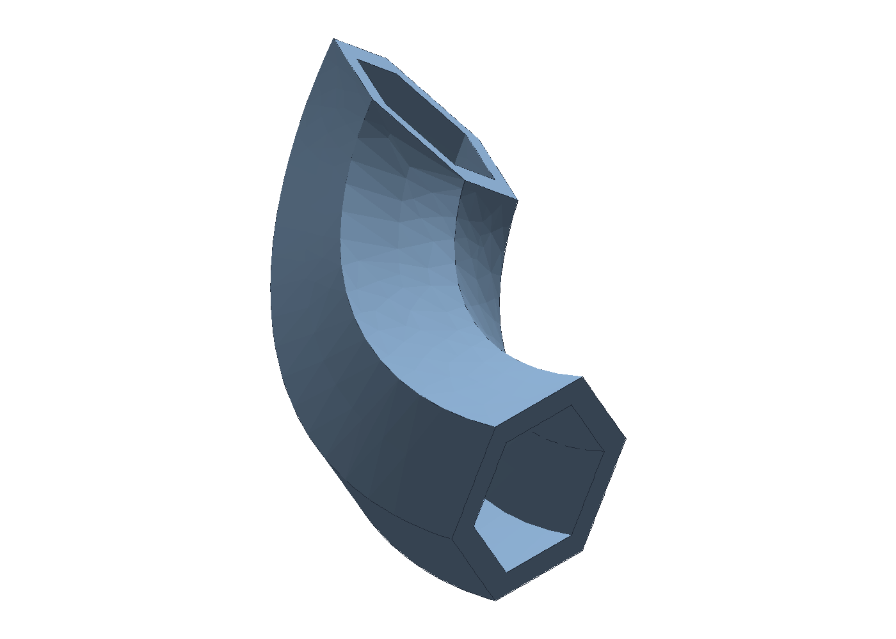
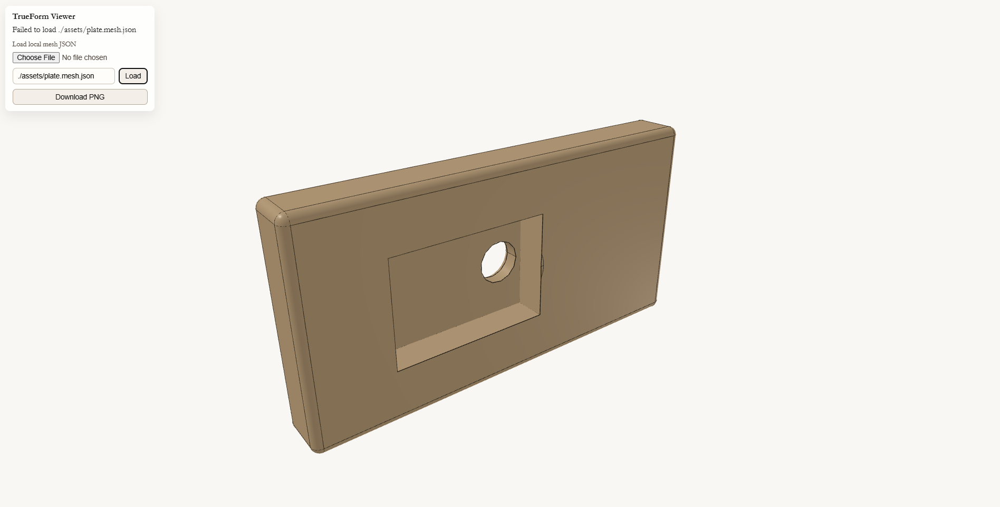

# TrueForm



Docs: [https://cpme.github.io/trueform/](https://cpme.github.io/trueform/)

For decades, enterprise CAD software companies have intentially obfuscated their files to create "vendor lock-in". Engineers hate their CAD systems, but can only dream of migration to better systems, that they will once again be locked into. While software has broadly seen explosive advancement, CAD has stagnated. Legacy file formats (STEP, IGES, OBJ, etc) are insufficient for reconstructing feature trees, and the CAD native file format remains locked behind closed doors. Hence we are stuck exchanging pdf drawings, and other lossy compressions of the rich machine readable detail embedded in the CAD native format. 

TrueForm aims to change that, by creating an open DSL (domain specific language) with rich abstractions that mirror the tools you are used to in enterprise CAD, and then some. Critically, it provides an intermediate representation and compiler (currently supports OpenCascade.js).

TrueForm is a declarative, intent-first modeling layer on top of OpenCascade.js. It lets agents and web apps describe **what** a part is (features, constraints, assertions) without scripting kernel steps.

The goal: hardware design that feels more like software. A single, digital definition is authored that retains the information needed to produce all the digital assets required in the product development lifecycle.

**Status**
- V1 compiles a JSON-serializable IR and builds with an OpenCascade.js backend.
- Current runtime target is Node + OpenCascade.js.
- Assemblies are data-only for now (compile warns).
- Experimental native OCCT backend is available for server-side CAD compute, including AP242 STEP export with XCAF PMI embedding via the native HTTP server.

**Quickstart**
```bash
git clone https://github.com/CPME/trueform.git
cd trueform
npm install
npm test
```

**Minimal Example**
```ts
import { buildPart } from "trueform";
import { part } from "trueform/dsl/core";
import { extrude, profileRect, profileRef, sketch2d } from "trueform/dsl/geometry";

const plate = part("plate", [
  sketch2d("sketch-base", [
    { name: "profile:base", profile: profileRect(100, 60) },
  ]),
  extrude(
    "base-extrude",
    profileRef("profile:base"),
    6,
    "body:main",
    ["sketch-base"]
  ),
]);

// const result = buildPart(plate, backend);
```

**Viewer (Verification Helper)**
Screenshot: generated from the DSL and viewed with the packaged viewer.



```bash
npm run viewer:export
```

One-command viewer (export + serve):

```bash
npm run viewer:serve
```

`viewer:serve` shuts down any prior viewer server on port 8001 before starting a new one.

Viewer setup, mesh schema, and options: `tools/viewer/README.md`.

**Docs**
- Overview and positioning: `specs/summary.md`
- Technical spec (IR, pipeline, backend boundary): `specs/spec.md`
- Functional tolerancing intent: `specs/functional-tolerancing-intent.md`
- Viewer helper + mesh schema: `tools/viewer/README.md`
- Native OCCT server (experimental): `native/occt_server/README.md`
- Docs map (source-of-truth guide): `specs/docs-map.md`
