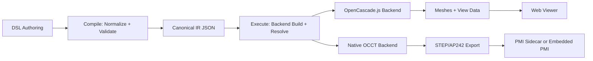

# TrueForm


Docs: [https://cpme.github.io/trueform/](https://cpme.github.io/trueform/)

TrueForm is a declarative, intent-first modeling layer that compiles to interchangeable geometric backends (OpenCascade.js today, native OCCT server support in progress).
It lets humans and agents describe what a part is (features, constraints, assertions)
without scripting kernel steps.

## Why

For decades, enterprise CAD vendors have locked data behind proprietary formats.
Legacy exchange formats (STEP, IGES, OBJ) lose feature history and intent, so teams
fall back to PDFs and other lossy artifacts. TrueForm aims to make hardware design
feel more like software: a canonical source of intent with deterministic compile,
plus ecosystem tools that generate downstream assets.

## Architecture



## Status
- V1 compiles a JSON-serializable IR and builds with an OpenCascade.js backend.
- Runtime target is Node + OpenCascade.js.
- Core compile is part-centric; assembly solving APIs are experimental and outside the core compile pipeline.
- Step 1 contract direction: mate connectors live on parts, and assembly intent is stored in a separate assembly file/document.
- Experimental native OCCT backend supports server-side CAD compute and AP242 export via native HTTP transport.

## Quickstart
```bash
git clone https://github.com/CPME/trueform.git
cd trueform
npm install
npm test
```

## Minimal Example
```ts
import { buildPart } from "trueform";
import { part } from "trueform/dsl/core";
import { extrude, profileRect, profileRef, sketch2d } from "trueform/dsl/geometry";

const plate = part("plate", [
  sketch2d("sketch-base", [
    { name: "profile:base", profile: profileRect(100, 60) },
  ]),
  extrude(
    "base-extrude",
    profileRef("profile:base"),
    6,
    "body:main",
    ["sketch-base"]
  ),
]);

// const result = buildPart(plate, backend);
```

## Viewer

Screenshot: generated from the DSL and viewed with the packaged viewer.


```bash
npm run viewer:export
```

One-command viewer (export + serve):

```bash
npm run viewer:serve
```

`viewer:serve` shuts down any prior viewer server on port 8001 before starting a new one.

Viewer setup, mesh schema, and options: `tools/viewer/README.md`.

## Docs
- Overview and positioning: `specs/summary.md`
- Technical spec (IR, pipeline, backend boundary): `specs/spec.md`
- Functional tolerancing intent: `specs/functional-tolerancing-intent.md`
- Viewer helper + mesh schema: `tools/viewer/README.md`
- Native OCCT server (experimental): `native/occt_server/README.md`
- Docs map (source-of-truth guide): `specs/docs-map.md`
