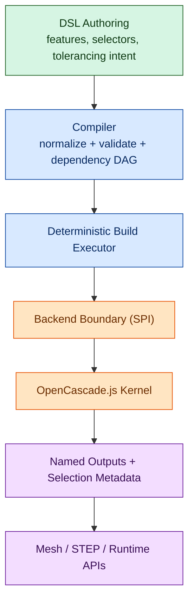

# Architecture

This is a short overview of the core concepts. The full technical specification lives in `specs/spec.md`.

## System Diagram

## Intent IR (Source of Truth)

- A document is a graph of features, datums, selectors, and constraints.
- The IR is canonical, deterministic, and JSON-serializable.
- No kernel history or kernel types are stored in the IR.

## Build Pipeline (Deterministic)

1. Normalize parameters and units.
2. Build a dependency DAG.
3. Execute features in deterministic order via a backend.
4. Resolve selectors against current geometry.
5. Optionally evaluate assertions post-build; tolerancing intent is carried in IR (constraints/assertions are placeholder data in v1 compile).

## Selectors and Datums

- Datums provide stable anchors.
- Selectors are semantic queries (e.g., “largest planar face normal to +Z”).
- Ambiguity is a compile error.

## Backend Boundary

- The backend executes normalized features and returns outputs + selection metadata.
- Kernel types remain backend-internal (OpenCascade.js in v1).

For details, see:
- `specs/spec.md`
- `specs/functional-tolerancing-intent.md`
- `docs/reference/dsl/index.md`
