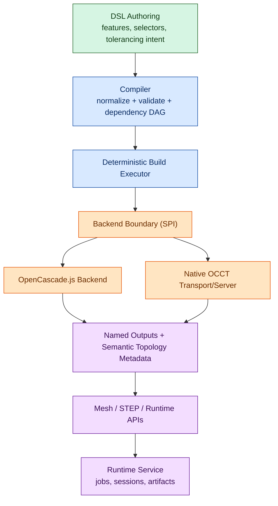

# Architecture

This is a short overview of the core concepts. The full technical specification lives in `specs/spec.md`.

## System Diagram

```mermaid
flowchart TB
  A["DSL Authoring<br/>features, selectors, tolerancing intent"] --> B["Compiler<br/>normalize + validate + dependency DAG"]
  B --> C["Deterministic Build Executor"]
  C --> D["Backend Boundary (SPI)"]
  D --> E["OpenCascade.js Backend"]
  D --> N["Native OCCT Transport/Server"]
  E --> F["Named Outputs + Semantic Topology Metadata"]
  N --> F
  F --> G["Mesh / STEP / Runtime APIs"]
  G --> H["Runtime Service<br/>jobs, sessions, artifacts"]

  classDef author fill:#d6f5e3,stroke:#1b5e20,color:#0f3a14;
  classDef compile fill:#d8e9ff,stroke:#0d47a1,color:#082a61;
  classDef backend fill:#ffe5c2,stroke:#e65100,color:#6b2d00;
  classDef output fill:#f3ddff,stroke:#6a1b9a,color:#3a0f56;

  class A author;
  class B,C compile;
  class D,E,N backend;
  class F,G,H output;
```

## Intent IR (Source of Truth)

- A document is a graph of features, datums, selectors, and constraints.
- The IR is canonical, deterministic, and JSON-serializable.
- No kernel history or kernel types are stored in the IR.

## Build Pipeline (Deterministic)

1. Normalize parameters and units.
2. Build a dependency DAG.
3. Execute features in deterministic order via a backend.
4. Resolve selectors against current geometry.
5. Optionally evaluate assertions post-build; tolerancing intent is carried in IR (constraints/assertions are placeholder data in v1 compile).

## Selectors and Datums

- Datums provide stable anchors.
- Selectors are semantic queries (e.g., “largest planar face normal to +Z”).
- Ambiguity is a compile error.

## Semantic Topology

- Stable references are carried through datums, selectors, named selections, and
  semantic selection metadata.
- Topology-changing operations should preserve semantic continuity through
  `createdBy`, owner/role metadata, aliases, and lineage where possible.
- When semantic continuity cannot be preserved, the system should fail explicitly
  rather than silently degrading to raw topology traversal.

## Backend Boundary

- The backend executes normalized features and returns outputs + selection metadata.
- Kernel types remain backend-internal.
- The OCCT.js backend is the primary in-process implementation.
- The native backend is available through local/HTTP transport adapters with
  explicit capability reporting and a live native parity loop for the currently
  supported feature surface.

## Package Surfaces

- `trueform` remains the aggregate compatibility facade.
- Public package-oriented entrypoints are also available through:
  - `@trueform/core`
  - `@trueform/dsl`
  - `@trueform/export`
  - `@trueform/api`
  - `@trueform/service-client`
  - `@trueform/backend-ocjs`
  - `@trueform/backend-native`
- Workspace package verification lives behind `npm run verify:workspace-packages`.

For details, see:
- `specs/spec.md`
- `specs/functional-tolerancing-intent.md`
- `docs/reference/dsl/index.md`
